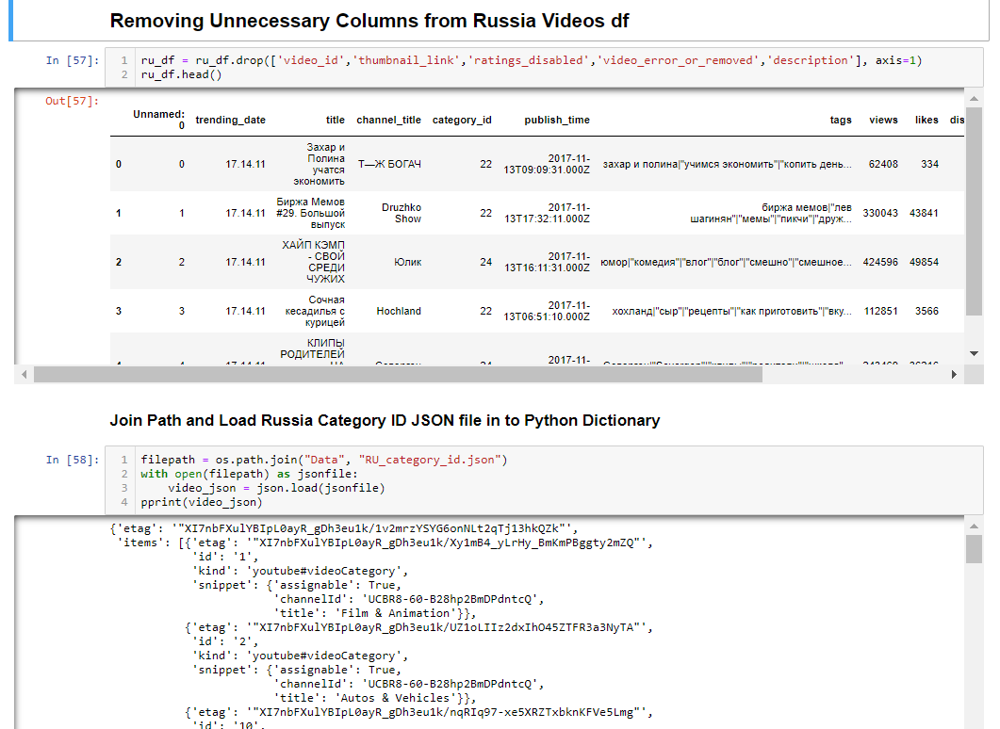

# ETL Project: Trending YouTube Videos (2017-2018) 

**Dataset Description:**	The data used in this project was taken from a publicly available dataset on Kaggle that was gathered using the YouTube API. The data used here was a collection of the top trending videos from YouTube for the years 2017-2018. YouTube determines the top trending videos of the year based on a combination of factors including views, likes, and comments (note: top trending videos are different than the most viewed videos of the year). For this project, we chose to compare the United States dataset of top trending videos to the Russia dataset. Both datasets included over 40,000 videos from the years 2017-2018 and various metrics about the videos, including the channel title, video title, video category, amount of likes/dislikes, comment count, views, and more. (Note: not every data point in this set is unique, since an individual video can be trending for multiple days. Some of the most popular videos will be in these datasets multiple times, because they were trending for multiple days).Source: https://www.kaggle.com/datasnaek/youtube-new 

## **Step 1: Extract, (translate), Transfer, Load Data**

## **Step 2: **ERD**

### **US Stats** (duplicates included)

- ​		 **Average Video Likes: 	74,266** 	
- ​		**Average Dislikes:  3,711**  
- ​		**Average Comment Count: 8,446**
- ​		**Average Views:**

### **Most liked video**: 

- ​		BTS

### **Most disliked video AND most commented video:** 

- ​		Logan Paul Apology Video- “So Sorry”

- ​		Shows that trending/number of comments is not always an indicator of people liking/enjoying the video 

  ​			(controversy is very popular) 

- ​		Also in Russian set which is funny

### **Most popular categories**

- ​		Music
- ​		Entertainment
- ​		Film & Animation
- ​		Comedy
- ​		People & Blogs

### **Most popular channel overall**

- ​		ESPN
- ​		The tonight show
- ​		The Ellen Show
- ​		Netflix
- ​		Vox

### **Russia Stats**

​		**Average Video Likes:**

​		**Average Dislikes:** 

​		**Average Comment Count:** 

### **Most liked video**:

### **Most disliked video:**

### **Most commented video:** 

### **Most popular categories**:

### **Most popular channel**:

