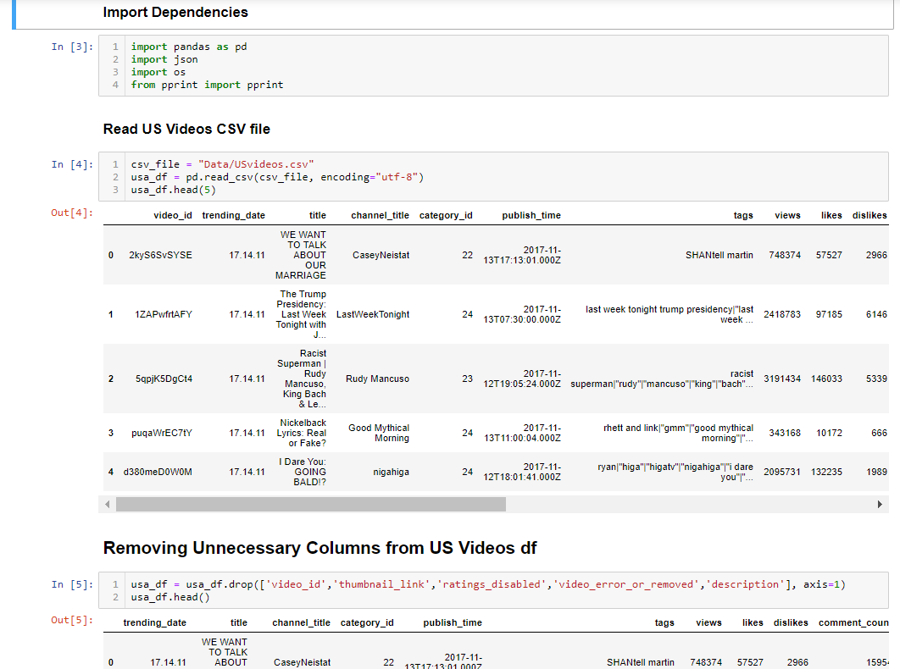
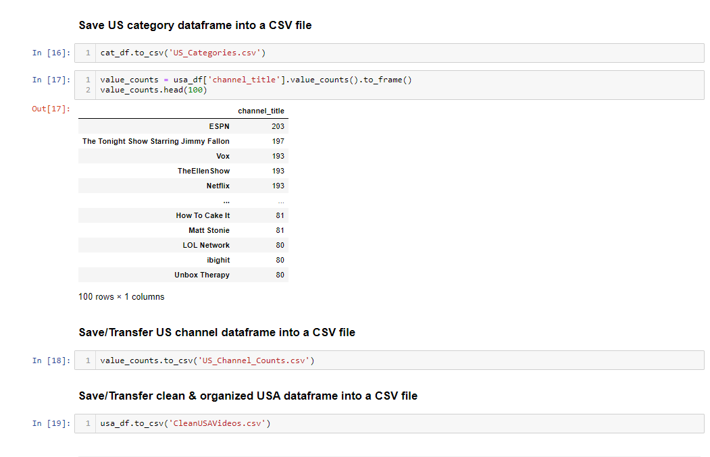
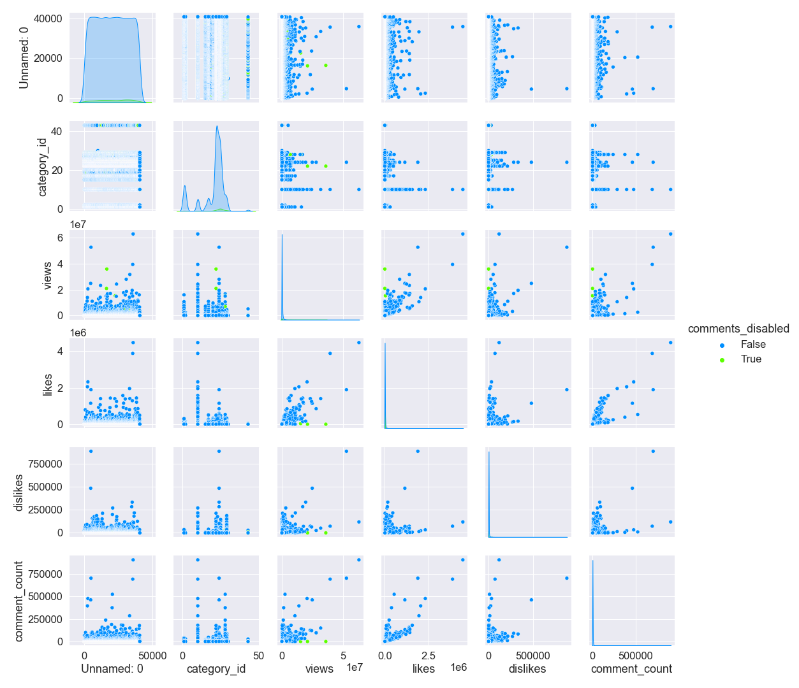
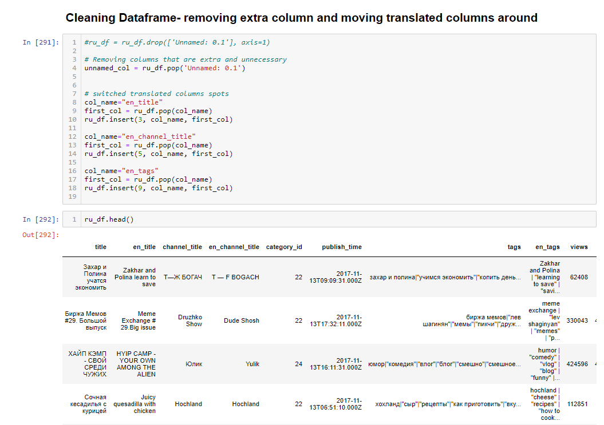

# ETL Project: Trending YouTube Videos (2017-2018)

#### Project Report and Analysis By:

- ##### Julia Squeri

- ##### Jen Mahon 

- ##### John Shuford

- ##### Fereshteh Aghaei

**Dataset Description:** The data used in this project was taken from a publicly available dataset on Kaggle that was gathered using the YouTube API. The data used here was a collection of the top trending videos from YouTube for the years 2017-2018. YouTube determines the top trending videos of the year based on a combination of factors including views, likes, and comments (note: top trending videos are different than the most viewed videos of the year). For this project, we chose to compare the United States dataset of top trending videos to the Russia dataset. Both datasets included over 40,000 videos from the years 2017-2018 and various metrics about the videos, including the channel title, video title, video category, amount of likes/dislikes, comment count, views, and more. (Note: not every data point in this set is unique, since an individual video can be trending for multiple days. Some of the most popular videos will be in these datasets multiple times, because they were trending for multiple days).Source: https://www.kaggle.com/datasnaek/youtube-new

---

## **Step 1: Extract, (translate), Transfer U.S.A Data**

----

[

## U.S.A Video's Comments Disabled  Pair-Plot

----

## Step 2: Extract, (translate), Transfer Russia Data

----

## Video's Comments Disabled  Pair-Plot

## Step 3: ERD

​														

# 			 	

## Step 4: Load

## Created Tables, Joined Tables & Data Calculation (Analysis)

We chose to use PGAdmin/PostgresSQL, a relational database, because our three datasets/tables could be linked together by the use of primary and foreign keys. These tables were able to relate to each other by the shared category IDs. 

After we were satisfied with the format of our dataframes, they were loaded into tables in Postgres (pgAdmin4) by forming a connection to the jupyter notebook through the creation of an engine (ORM). This involved creating tables in PostgreSQL that we can load our data into using Pandas. Each table is assigned a primary key (typically id) for relational purposes. We created tables with the number and names of columns present in the dataframes we previously created.

The file 'SQL_tables.sql' includes the code for our tables, and 'table_joins.sql' includes the code for our joins.
The files 'jes_queries.sql','jm_sql_work.sql', and 'jm_queries.sql' include all of the queries run for this project.

## Results
=======

## **US Stats** 

- ​		 **Average Video Likes: 74,267** 	
- ​		**Average Dislikes:  3,711**  
- ​		**Average Comment Count: 8,446**
- ​		**Average Views: 2,360,785**

### **Most liked video**: BTS, "'Fake Love' Official Music Video"

* Likes: **5,613,827**
* Dislikes: **206,892**
* Comment Count: **1,228,655**

### **Most disliked video**: Logan Paul Vlogs, “So Sorry”

* Likes: **1,402,578**
* Dislikes: **1,674,420**
* Comment Count: **1,361,580**

### **Most commented video:** Logan Paul Vlogs, "So Sorry"

* Likes: **1,402,578**
* Dislikes: **1,674,420**
* Comment Count: **1,361,580**

### **Most popular categories**(as measured by views)

* Music: **40,132,892,190 views**
    * Most viewed video/channel: ChildishGambinoVEVO, “This is America Music Video” **(225,211,923 views)**

* Entertainment: **20,604,388,195 views**
    * Most viewed video/channel: YouTube Spotlight, ‘"YouTube Rewind: The Shape of 2017 | #YouTubeRewind" **(149,376,127 views)**
    
* Film & Animation: **7,284,156,721 views**
    * Most viewed video/channel: Selena Gomez, “Back to You (Lyric Video)” **(54,863,912 views)**
    
* Comedy: **5,117,426,208 views**
    * Most viewed video/channel: Hannah Stocking, “Poo Bear ft. Justin Bieber & Jay Electronica - Hard 2 Face Reality (Lyric Video)” **(29,178,096 views)**
    
* People & Blogs: **4,917,191,726 views**
    * Most viewed video/channel: Kylie Jenner, “To Our Daughter" **(56,111,957 views)**

### **Most popular channel overall**(as measured by the number of times the channel occured in dataset)

* ESPN: **203** trending videos (category: sports)
* The tonight show: **197** videos (comedy)
* The Ellen Show: **193** videos (entertainment)
* Netflix: **193** videos (entertainment)
* Vox: **193** videos (news & politics)

## **Russia Stats**

- ​		**Average Video Likes: 12,435**
- ​		**Average Dislikes: 1,475** 
- ​		**Average Comment Count: 1,775** ​        
- ​		**Average Views: 240,715**

### **Most liked video**: BTS, "‘Fake Love’ Official Music Video"

* Likes: **4,470,923**
* Dislikes: **119,053**
* Comment Count: **905,925**

### **Most disliked video:** YouTube Rewind, "The Shape of 2017"

* Likes: **1,891,836**
* Dislikes: **884,967**
* Comment Count: **702,790**

### **Most commented video:** BTS, "‘Fake Love’ Official Music Video"

* Likes: **4,470,923**
* Dislikes: **119,053**
* Comment Count: **905,925**

### **Most popular categories**: (as measured by views)

* Entertainment: **2,088,743,148 views**
    * Most viewed video/channel: YouTube Spotlight, “YouTube Rewind: The Shape of 2017 | #YouTubeRewind" **(52,611,730 views)**
* Music: **1,605,269,644 views**
    * Most viewed video/channel: ibighit, “BTS (방탄소년단) 'FAKE LOVE' Official MV" **(62,796,390 views)**
* People & Blogs: **1,564,739,895 views**
    * Most viewed video/channel: Kylie Jenner “To Our Daughter" **(35,832,484 views)**
* Comedy: **1,021,361,186 views**
    * Most viewed video/channel: The Tonight Show Starring Jimmy Fallon, “Musical Genre Challenge with Ariana Grande"**(7,172,963 views)**
* News & Politics: **739,248,272 views**
    * Most video/viewed channel: PewDiePie “"LOGAN PAUL RETURNS 📰 PEW NEWS📰" **(6,975,564 views)**

### **Most popular channel**: (as measured by the number of times the channel occured in dataset)

* Анатолий Шарий (Anatoly Shariy): **196** trending videos (category: comedy)
* Эхо Москвы (Echo of Moscow): **184** videos (news & politics)
* Модные Практики с Паукште Ириной Михайловной (Fashion Practices with Paukshte Irina Mikhailovna): **168** videos (how-to & style)
* Wylsacom: **167** videos (science & technology)
* Kamikadzedead: **158** videos (comedy)

## **Observations**
=======
* The US and Russia share the same most popular video of the year, the BTS music video for their song ‘Fake Love’.
* Many videos that were trending were popular in both countries (Youtube spotlight, Kylie Jenner, BTS, Logan Paul).
* US media is pretty popular in Russia, but most US videos are from US creators/content channels.
* The most viewed channels per category are not necessarily the most popular channels. When comparing the most popular categories as measured by views to the most popular channels measured by how many times they ended up on the trending list, you can see that these do not always line up. For example, in Russia, the comedy channel video with the most views is from Jimmy Fallon, but the comedy channel with the greatest amount of trending videos is Anatoly Shariy. This means that Jimmy Fallon had one incredibly popular video, but that Anatoly Shariy had many popular videos. 
* The most disliked videos still have alot of engagement, suggesting that views/comments might not be a valuable metric of likeability, and that ‘controversies’ can be very popular (for example, the most disliked and most commented on video in the US was an apology video from Logan Paul Vlogs).
* A trending video may receive a mass amount of views, but a large amount of views doesn’t necessarily mean a large amount of likes. For example, in the US, “Childish Gambino - This is America” received the most views at 225,211,923, but was liked only 2.2% of the time. The video with the highest percentage of likes per view was “Bruno Mars - Finesse”, receiving 29% of likes in a video viewed 548,621 times. In Russia, the most watched video “BTS - Fake Love” received 62,796,390 views with just 7.1% liking the video. However, the video with the highest percentage of likes per view was “Mora Saiyaan” with 94% of viewers liking the video.
* There are a few limitations to comparing the amount of views a video receives to the amount of likes and/or dislikes it receives. You do not need to have an account with YouTube to view videos, but you do need an account in order to like, dislike, or comment on a video. This limits the amount of viewers that could potentially interact with the video.
